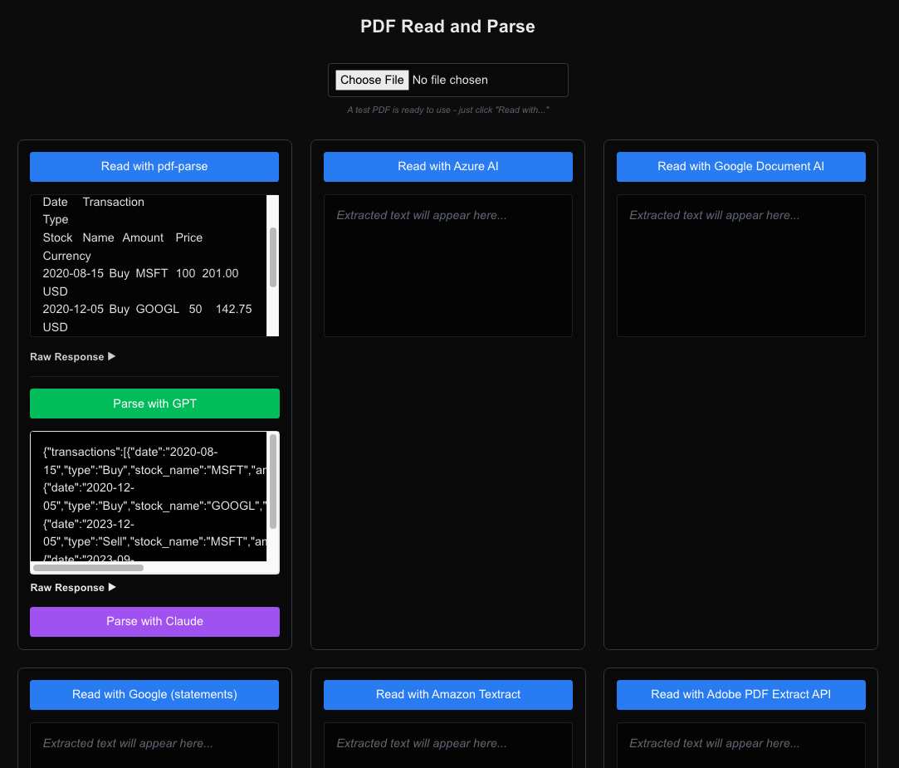

# PDF Reader and Analysis Tool

This tool compares the performance of several OCR/PDF reader services and leverages OpenAI's Assistant API to parse extracted text and structure it according to a provided schema.



## Prerequisites

Before you begin, create a `.env` file in the root directory with the following environment variables:

### Azure AI Document Intelligence
```plaintext
AZURE_READ_ENDPOINT=your_azure_endpoint
AZURE_READ_KEY=your_azure_key
```

### Adobe PDF Services
```plaintext
PDF_SERVICES_CLIENT_ID=your_adobe_client_id
PDF_SERVICES_CLIENT_SECRET=your_adobe_client_secret
```

### Google Cloud
```plaintext
GOOGLE_PROJECT_ID=your_project_id
GOOGLE_LOCATION=your_location
GOOGLE_PROCESSOR_ID=your_processor_id
GOOGLE_STATEMENT_PROCESSOR_ID=your_statement_processor_id
GOOGLE_KEY_FILE_PATH=path_to_your_service_account_key_file
```

### AWS
```plaintext
AWS_REGION=your_aws_region
AWS_ACCESS_KEY_ID=your_aws_access_key
AWS_SECRET_ACCESS_KEY=your_aws_secret_key
```

### OpenAI
```plaintext
OPENAI_API_KEY=your_openai_key
OPENAI_ASSISTANT_ID=your_assistant_id
```

### Anthropic Claude
```plaintext
ANTHROPIC_API_KEY=your_anthropic_key
```

## Getting Service Credentials

### Azure AI Document Intelligence
1. [Create an Azure account](https://azure.microsoft.com/en-us/free/).
2. Create an [Azure AI Document Intelligence resource](https://learn.microsoft.com/en-us/azure/ai-services/document-intelligence/).
3. Retrieve the **Endpoint** and **Key** from the **Keys and Endpoint** section in the Azure portal.

### Adobe PDF Services
1. [Register for Adobe PDF Services](https://www.adobe.com/enterprise/experience/pdf-services.html).
2. Create a new project and retrieve the **Client ID** and **Client Secret** from your project credentials.

### Google Cloud
1. [Create a Google Cloud account](https://cloud.google.com/).
2. [Enable the Document AI API](https://cloud.google.com/document-ai).
3. Create processors for general Documents AI model and their specific bank statements model (that's what I've tried for parsing transactions statements (wasn't that good). You can use any other processor for different types of documents).
4. Set up a service account, download the credentials JSON, and place it in your project root.

### AWS
1. [Create an AWS account](https://aws.amazon.com/).
2. Create an IAM user with **Textract** access ([documentation](https://docs.aws.amazon.com/textract/latest/dg/getting-started.html)).
3. Generate the **Access Key** and **Secret Key**.
4. Choose your preferred **AWS Region**.

### OpenAI
1. [Sign up for OpenAI](https://platform.openai.com/signup).
2. Generate an [API key](https://platform.openai.com/account/api-keys).
3. Create an Assistant:
   - Visit the [OpenAI Platform](https://platform.openai.com/).
   - Navigate to **Assistants**.
   - Create a new assistant and configure it for parsing OCR output.
   - Copy the **Assistant ID**.

### Anthropic Claude
1. [Sign up for Anthropic](https://console.anthropic.com/).
2. Generate an [API key](https://console.anthropic.com/settings/keys).
3. Note: This implementation uses the Claude-3 Haiku model for cost-effectiveness while maintaining high accuracy for structured data extraction.
4. Also note: You can see the example of the response I've prompted Claude to return in the `app/api/services/claudeService.ts` file. Change it to fit your needs.

## Running the Project

This is a [Next.js](https://nextjs.org) project, bootstrapped with [`create-next-app`](https://nextjs.org/docs/app/api-reference/cli/create-next-app).

### Getting Started

To run the development server, execute one of the following commands:

```bash
npm run dev
# or
yarn dev
# or
pnpm dev
# or
bun dev
```

Once the server is running, open [http://localhost:3000](http://localhost:3000) in your browser to view the app.

You can edit the page by modifying `app/page.tsx`. The page will auto-update as you make changes.

### Font Optimization

This project uses [`next/font`](https://nextjs.org/docs/app/building-your-application/optimizing/fonts) to optimize and load the [Geist font](https://vercel.com/font) for a modern look and feel.

## Learn More

To dive deeper into Next.js, explore the following resources:

- [Next.js Documentation](https://nextjs.org/docs) – Learn about Next.js features and APIs.
- [Learn Next.js](https://nextjs.org/learn) – An interactive tutorial to master Next.js.

Check out the [Next.js GitHub repository](https://github.com/vercel/next.js) for contributions, issues, and the community.

## Deploy on Vercel

The easiest way to deploy your Next.js app is via the [Vercel Platform](https://vercel.com/new?utm_medium=default-template&filter=next.js&utm_source=create-next-app&utm_campaign=create-next-app-readme).

For detailed deployment instructions, refer to the [Next.js Deployment Documentation](https://nextjs.org/docs/app/building-your-application/deploying).
